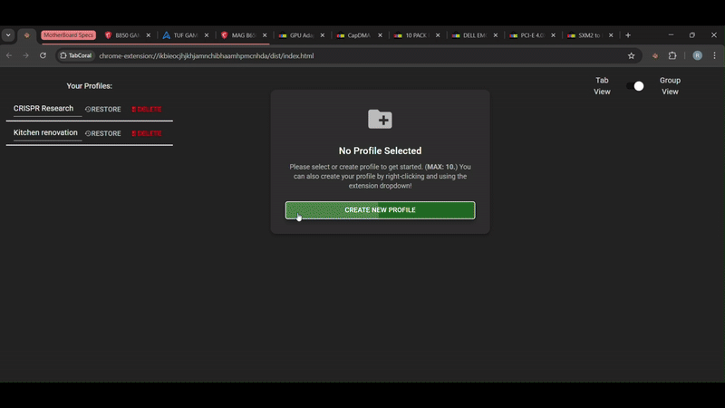
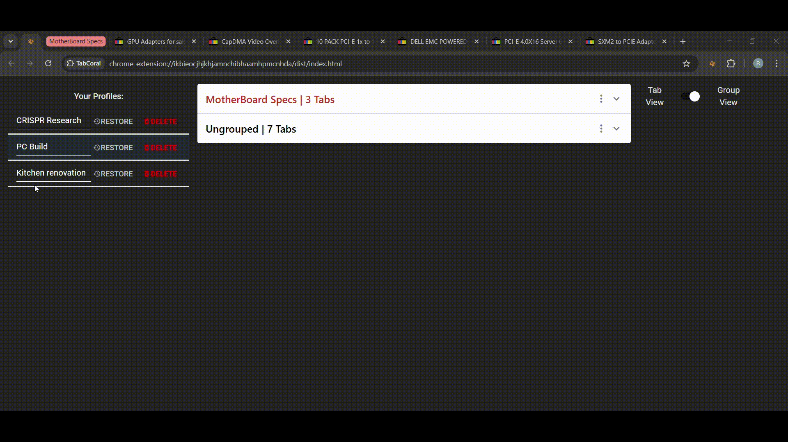
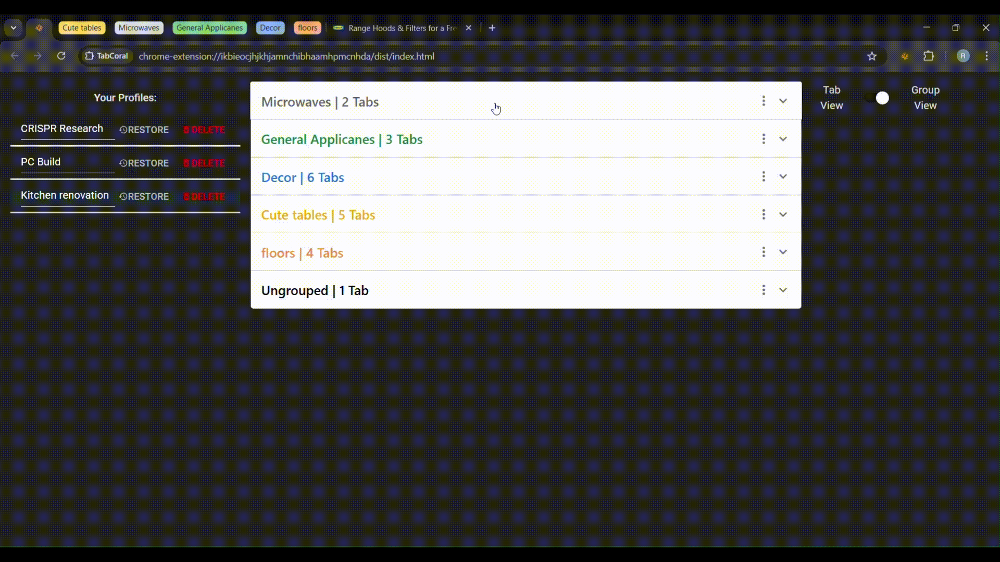
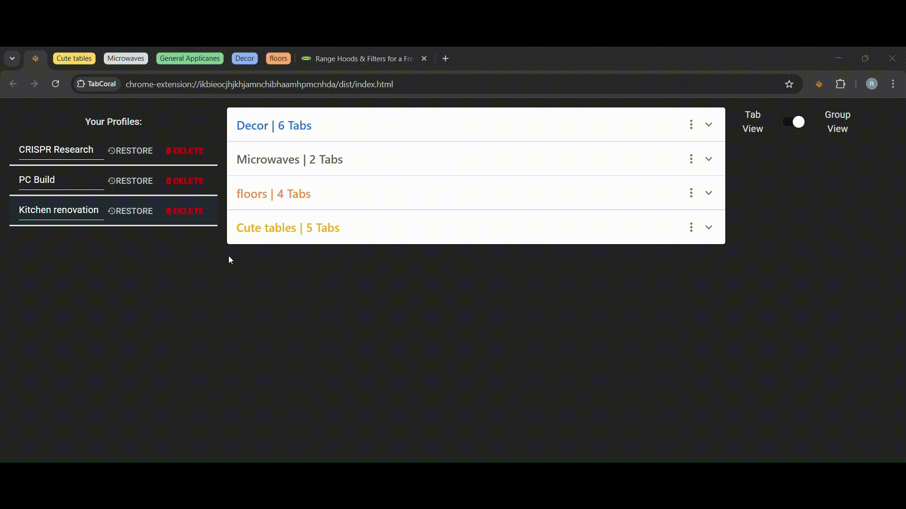
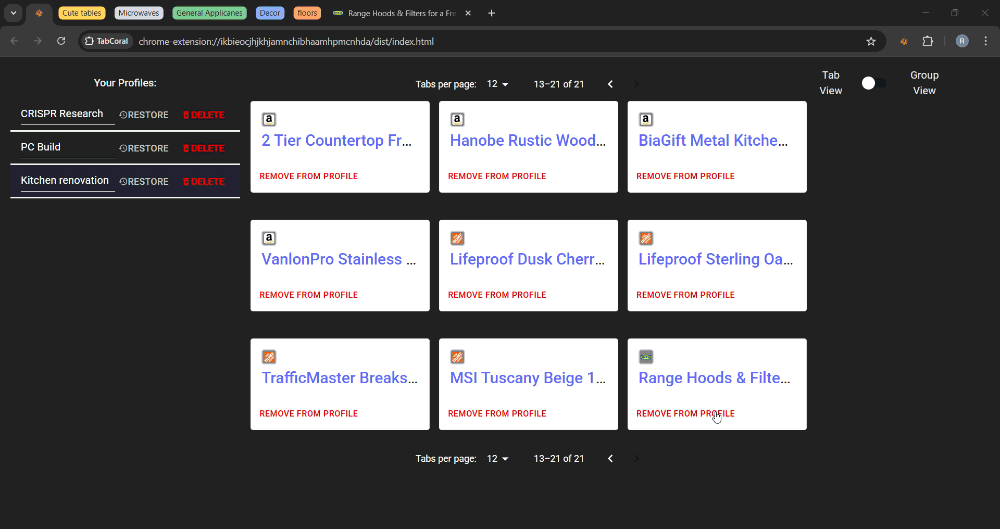
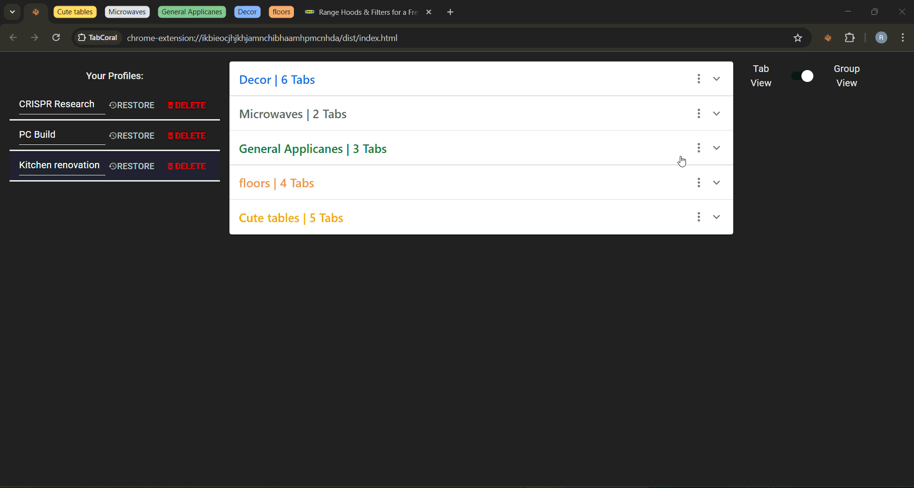

# TabCoral 

> A smart Chrome Extension to save and organize tabs into profiles — helping you declutter Chrome, boost performance, and easily switch between workflows.

> Now available on the [chrome store](https://chromewebstore.google.com/detail/tabcoral/mnmabfgedpiboodebmlplmicbggekdek)!

---

## **Why TabCoral?**

Are you drowning in Chrome tabs? 

I know all too well how quickly 100+ tabs and 15+ groups can slow your browser and kill productivity. **TabCoral** was built to fix this:

- Save all your open tabs and tab groups into organized profiles.
- Reopen sessions instantly! no more digging through history.
- Keep your dashboard pinned to the far left, acting as a hub for your workflows.
- Reduce Chrome memory usage by archiving tabs instead of leaving them open.

---

## **🚀 Features**
- Create, save, and manage multiple **tab profiles** (e.g., Work, Research, Gaming).
- View all your open tabs and tab groups in a clean dashboard.
- Reopen saved groups and tabs with a single click.
- Delete or rename saved profiles on the fly.
- Persistent dashboard that reopens even after Chrome restarts.
- Built with a **modern UI (Material UI + React)**.

---

## **🎥 Demo & Screenshots**
Here are a few highlights of TabCoral in action:

  
 
  




---

## **🛠 Tech Stack**
- **Frontend**: React, Vite, Redux, Material UI
- **Extension Core**: JavaScript (Manifest V3), Chrome Extensions API
- **Dashboard**: TypeScript (React Components)

---

## **📌 TabCoral Roadmap**

### **MVP**
- [x] Extension dashboard is present on install and persistent through crashes.
- [x] User can view their current tab and group setup in a side panel.
- [x] User can save all open groups and tabs to a profile.
- [x] User can view saved tab groups in an organized way on a dashboard page.
- [x] User can reopen saved groups with a single click.
- [x] User can delete pages/groups from the dashboard.
- [x] User can create working profiles (Work, Gaming, Research, etc.).
- [x] User can delete profiles.
- [x] User can switch between profiles.
- [x] User can restore profiles to the browser.
- [x] User can rename a profile.
- [x] QOL updates to profiles and workflow & bugfixes.
- [x] Styling improvements.
- [x] Chrome Web Store publishing.

### **Post MVP**
- [ ] Cross-browser sync.
- [ ] App themes (black, white, etc.).

---

## **🔧 Installation (Developer Mode)**

1. Clone this repository:
   ```bash
   git clone https://github.com/ronKzl/TabCoral.git
2. Change directory to the vite folder
   ```bash
   cd dashboard-ui/dashboard
3. Install dependencies and build the project
   ```bash
   npm install
   npm run build
4. Load into chrome extensions using developer mode.

## **🔒 Privacy**

TabCoral stores all data **locally** in Chrome's `chrome.storage.local`.  
The extension never collect, transmit, or share any user data.

[Read the full Privacy Policy here.](https://ronkzl.github.io/tabcoral-privacy.html)

